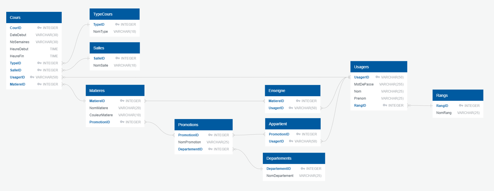

## Rapport Technique
---
Voici un mini-rapport vous indiquant diverses informations sur le projet de PWEB2 où l'ojectif été de crée un site web dynamique les emplois du temps de la faculté des sciences.
Pour ce projet, nous avons simplifié le contenu des données en nous concentrant sur les promotions : Maths, Info, SVT, Chimie et sans prendre en compte une répartition TD / TP.

### 1. Les choix techniques

Pour les choix techniques utilisés lors de la réalisation du projet, nous avons utilisés une base Bootstrap comme css pour la mise en page et les styles des formulaires. Nous avons ensuite réaliser notre propre css au sein du dossier style.css. Pour le JavaScript, nous avons utilisé JQuery et plus particulièrement l'Ajax permettant de rendre le site dynamique et fluide sans rechargement de page. Pour le reste, nous nous sommes basé sur le langage PHP pour ce qui est de la réalisation de L'EDT et d'autres requêtes.

### 2. L'architecture choisie

Pour l'architecture du site, nous l'avons décomposée en plusieurs dossiers.

* **./assets :** dossier contenant l'ensemble des styles de pages (css), script javascript (js), images (img), ainsi que de la bibliothèque d'icones Material Design Icons, qui est libre de droits, et se trouvant au sein du dossier **fonts**. 

* **./config :** dossier où se trouve la base de donnée SQLite3 au format .db ainsi qu'un fichier PHP nommé pdo qui s'occupe simplement de la connexion à cette base de deonnée.

* **./sql :** dossier qui contient l'ensemble des fichiers (sql) permettant la création des tables ainsi que l'insertion des données pré-requis. De plus, vous y trouverez un schéma de la base de donnée au format PNG.

* **./src :** dossier contenant les classes PHP. Ceux-ci sont scindé en deux sous-dossiers, l'un App qui contient les classes générales au site (contient seulement une classe Validator qui s'occupe de la vérification des formulaires du site), et l'autre Planning pour les classes centré sur l'emploi du temps (contient une classe modélisant une semaine, une autre s'occupant des événements d'une semaine précise, et d'autres classes pour les formulaires qui hérites de la classe Validator).

* **./views :** dossier contenant les scripts utilisés pour chaque pages. Dans le cadre du projet, il contient seulement ceux du header et du footer.

* Enfin dans la racine, se trouve l'ensemble des pages (index, gestion, admin, etc...), un .htaccess qui s'occupe d'empêcher l'accès à certains dossier et de pouvoir accéder aux pages sans le '.php' dans l'url. 
  

### 3. La base de donnée

Ci-dessous vous trouverez le schéma de la base de donnée utilisé pour le projet.
Vous pourrez également consulter ce schéma depuis le dossier **sql** du site (schema_db.png).

